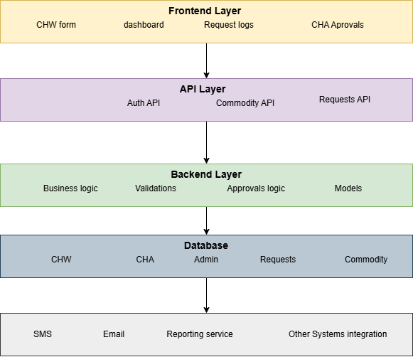
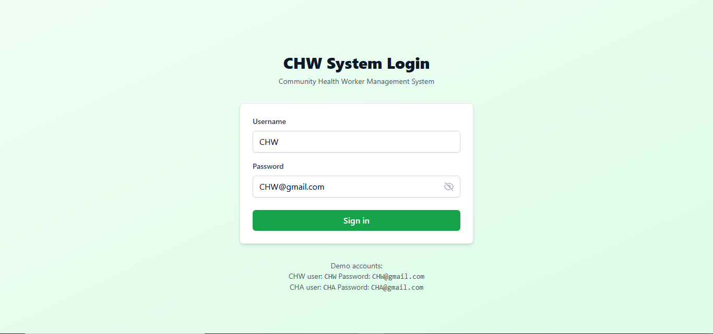

# CHW Management System

A system designed to manage Commodity Health Workers (CHWs) and their requests for commodities, with approval workflows managed by Community Health Assistants (CHAs). The backend is built using Django, and the frontend uses React.js.

## Overview

The CHW Management System allows CHWs to request commodities dynamically added by admin users. CHAs can approve or reject these requests through a user-friendly dashboard. The system enforces constraints such as a maximum of 200 units per month and one request per day per commodity per CHW. It also includes role-based access control, auditing, and data privacy compliance.

## Features

- **User Roles:**

  - CHW (Commodity Health Worker): Can submit commodity requests.
  - CHA (Community Health Assistant): Can approve or reject commodity requests.
  - Admin: Can manage users, commodities, and system settings.

- **Request Management:**

  - Dynamic commodity listing.
  - Request validation (e.g., quantity < 100, whole numbers only).
  - Daily and monthly request limits enforced.
  - Approval workflow with status tracking (Pending, Approved, Rejected).

- **Dashboard:**
  - Real-time statistics (Total Requests, Pending, Approved, Rejected).
  - Recent request logs.
  - Filters for request status.

## System Architecture

The system is divided into two main components:

### Backend (Django)

- Built using Django for robust ORM, admin interface, and validation.
- Uses Django REST Framework (DRF) to expose APIs for the frontend.
- Implements permissions and approval workflows.

### Frontend (React.js)

- Built using React.js for dynamic and interactive UI.
- Fetches data from the backend APIs.
- Includes form validations and real-time updates.
  

## Installation

### Backend Setup

1. **Clone the Repository:**

   ```bash
   git clone https://github.com/yourusername/chw-system.git
   cd chw_system/backend
   ```

2. **Create a Virtual Environment:**

   ```bash
   python -m venv venv
   source venv/bin/activate  # On Windows: venv\Scripts\activate
   ```

3. **Install Dependencies:**

   ```bash
   pip install -r requirements.txt
   ```

4. **Set Up Database:**

   ```bash
   python manage.py migrate
   ```

5. **Run the Server:**
   ```bash
   python manage.py runserver
   ```

### Frontend Setup

1. **Navigate to the Frontend Directory:**

   ```bash
   cd ../frontend
   ```

2. **Install Dependencies:**

   ```bash
   npm install
   ```

3. **Start the Development Server:**
   ```bash
   npm run dev
   ```

## Usage

1. **Access the Backend API:**

   - The backend API is accessible at `http://localhost:8000/api/`.

2. **Access the Frontend:**

   - The frontend is accessible at `http://localhost:3000`.

3. **Login:**

   - Use predefined credentials or create new users via the Django admin panel (`http://localhost:8000/admin/`).

4. **Submit Requests (CHW):**

   - Navigate to the "New Request" page to submit commodity requests.

5. **Approve Requests (CHA):**
   - Navigate to the "Pending Approvals" page to review and approve/reject requests.

## Screenshots

### Login



### CHW dashboard


### CHA requests page


### CHW request comodities form


### CHA dashboard


### CHA pending approvals page


### CHA request approval modal


### CHA approved request


### CHW comodities requested page


## Technologies Used

- **Backend:**

  - Python
  - Django
  - Django REST Framework
  - PostgreSQL

- **Frontend:**
  - React.js
  - Vite
  - Tailwind CSS
